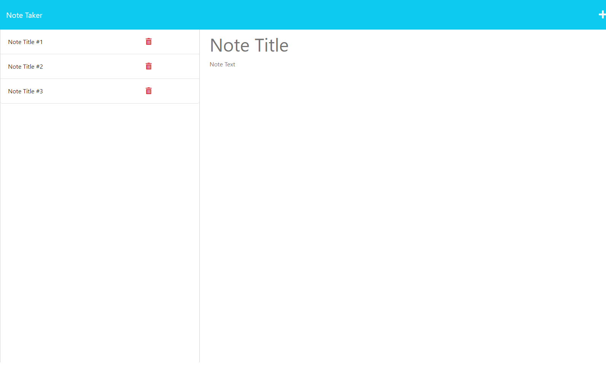

# Note Taker

## Description
This simple application gives you a way to create, view, and delete notes. This application uses Node.JS and Express.JS to handle the backend. Notes are stored in a JSON file.

## Table of Contents
1. [Installation](#installation)
2. [Usage](#usage)
3. [License](#license)
4. [Contributing](#contributing)
5. [Tests](#tests)
6. [Questions](#questions)

## Installation
You must install Node.JS (I used version 16.19.0) and then run 'npm start' to start the server.

## Usage
Run 'npm start' via CLI.

## License
This project is covered by the following license: [MIT License](https://opensource.org/licenses/MIT)

## Contributing
If you would like to contribute to the project, please contact me with one of the methods listed in the 'Questions' section.

## Tests
There are currently no tests for this program.

## Questions
Contact me at:
* GitHub - [dhoneck](https://github.com/dhoneck)
* Email - honeck_34@hotmail.com

